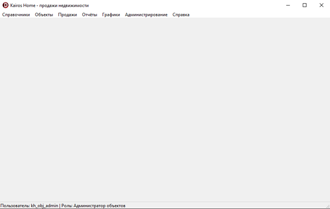
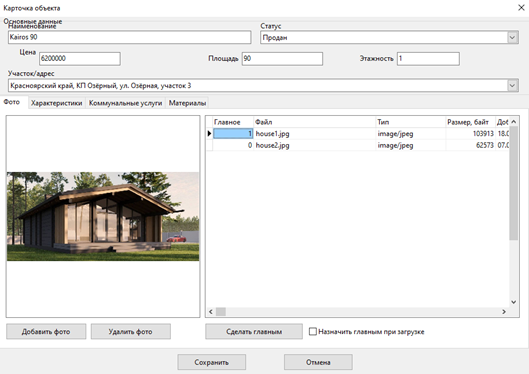

# kairos_home

A desktop Windows application for managing real estate objects, clients, contracts, reports, and analytics.

This is a coursework project completed in the 6th semester of the 3rd year at university.

## Tech stack
- Delphi / Object Pascal
- VCL
- ADO / ODBC
- MySQL
- SQL views, procedures, and triggers
- Embarcadero RAD Studio
